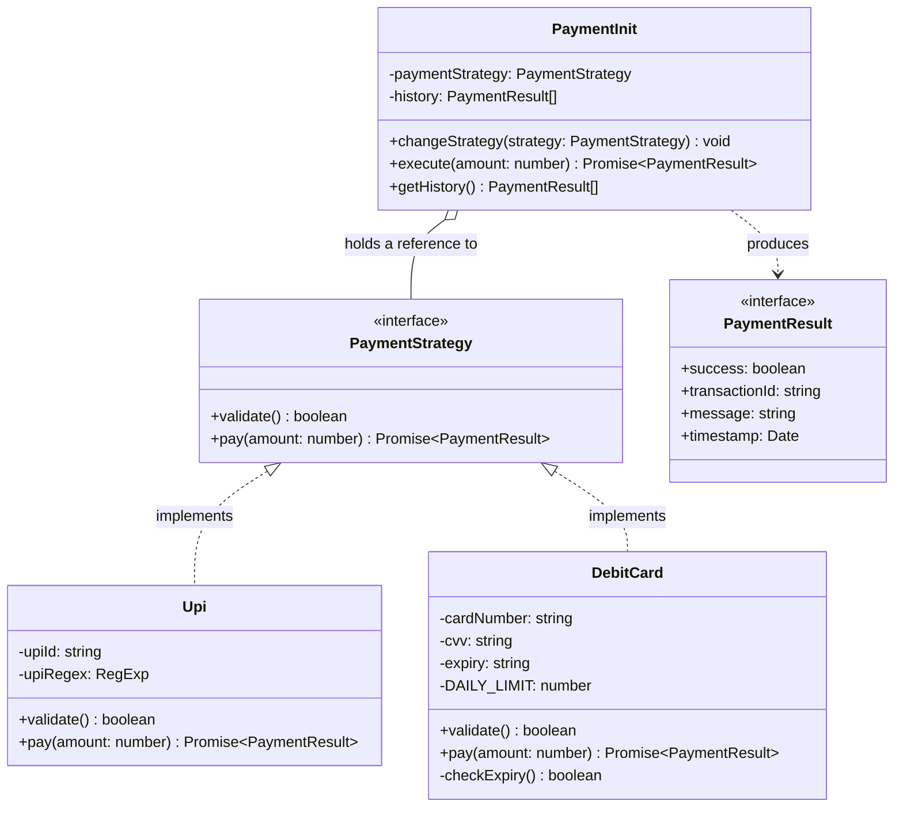
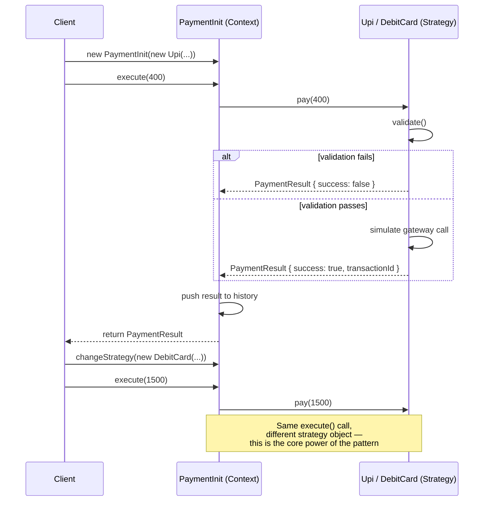
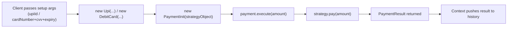

# Strategy Design Pattern — Payment Service (Complete Guide)

A production-style implementation of the **Strategy Design Pattern** using a Payment Service example (UPI + Debit Card), with validation, async handling, and transaction history.

---

## 📌 What Problem Does This Solve?

Without Strategy pattern, payment code usually ends up like this:

```typescript
function pay(type: string, amount: number) {
  if (type === "upi") {
    // upi logic
  } else if (type === "debit") {
    // debit logic
  } else if (type === "credit") {
    // credit logic
  }
  // adding a new payment method = editing this function again ❌
}
```

This violates the **Open/Closed Principle** (code should be open for extension, closed for modification). Strategy pattern fixes this by moving each payment method into its own interchangeable class.

---

## 🏗️ Architecture Diagram



**Kaise padhna hai ye diagram:**
- `<|..` (dashed arrow with hollow triangle) = "implements" — `Upi` aur `DebitCard` `PaymentStrategy` interface ka contract follow karte hain
- `o--` (hollow diamond) = "composition/has-a" — `PaymentInit` ek `PaymentStrategy` ko apne andar hold karta hai
- `..>` (dashed arrow) = "depends on / produces" — `PaymentInit` ka output `PaymentResult` type ka hota hai

---

## 🔄 Runtime Flow Diagram



---

## 🧩 Main Components (Table)

| Component | Role | Analogy |
|---|---|---|
| `PaymentStrategy` (interface) | Contract jo har payment method ko follow karna hai | Menu card — sirf naam batata hai, khana nahi banata |
| `Upi`, `DebitCard` (concrete classes) | Actual payment logic, validation, gateway simulation | Chef jo apne tarike se dish banata hai |
| `PaymentInit` (context) | Strategy ko hold karta hai, execution delegate karta hai, history maintain karta hai | Waiter — order leta hai, kitchen (strategy) ko bhejta hai, result serve karta hai |
| `PaymentResult` (interface) | Structured output — success, transactionId, message, timestamp | Bill/Receipt jo customer ko milta hai |
| `generateTransactionId()` (helper) | Har payment ke liye unique traceable ID | Order number |

---

## 📂 Suggested Folder Structure (Real Project Mein)

```
payment-service/
├── strategies/
│   ├── PaymentStrategy.ts      → interface
│   ├── Upi.ts                  → concrete strategy
│   └── DebitCard.ts            → concrete strategy
├── context/
│   └── PaymentInit.ts          → context class
├── factory/
│   └── PaymentFactory.ts       → optional: object creation logic
├── types/
│   └── PaymentResult.ts        → shared types
└── index.ts                    → client code
```

---

## ⚙️ How Data Flows (Arguments)



Do tarah ke arguments yaad rakho:

| Type | Kab pass hota hai | Example |
|---|---|---|
| Setup/Identity args | Object banate waqt, constructor mein | `upiId`, `cardNumber`, `cvv` |
| Runtime/Action args | Actual kaam karte waqt, method call mein | `amount` in `execute(amount)` |

---

## ✅ When To Use This Pattern

- Multiple algorithms/methods ek hi kaam ke liye (payment, sorting, discount, shipping cost)
- `if-else`/`switch` chain type check karne ke liye badh rahi ho
- Runtime pe behavior switch karna ho (user payment method change kare)

## ❌ When NOT To Use

- Sirf ek hi tareeka hai kaam karne ka (over-engineering hoga)
- Strategies kabhi change nahi hongi aur future mein bhi nayi add hone ka chance nahi

---

## 🍒 Extra Tips (Cherry on the Cake)

1. **Result object return karo, sirf boolean nahi** — production mein transactionId, message, timestamp sab chahiye hote hain logging/debugging/refund ke liye.
2. **Async by default socho** — real payment gateway calls kabhi synchronous nahi hoti.
3. **Validation ko separate method rakho** (`validate()`) — `pay()` ke andar hi mat ghusao, isse testing aasan hoti hai.
4. **Sensitive data mask karo** logs mein (`**** **** **** 1234`) — security best practice.
5. **Factory pattern combine karo** jab strategies 4-5 se zyada ho jaye — object creation client se hide ho jayega.
6. **Golden rule:** *"Interface decides WHAT, concrete class decides HOW, context decides WHEN, client decides WHICH."*
7. **SOLID connection:** Ye pattern Open/Closed Principle ka textbook example hai — naya payment method add karna ho toh sirf ek naya class banao, purana code touch nahi karna padta.

---

## 🔍 Self-Check Before Calling It Production-Ready

- [ ] Interface mein sirf method signatures hain, koi implementation logic nahi
- [ ] Har concrete strategy apna `validate()` khud handle karti hai
- [ ] Context kisi concrete class ka naam directly nahi jaanta (sirf interface pe depend karta hai)
- [ ] `changeStrategy()` jaisa method hai jo runtime switching allow kare
- [ ] Result object mein enough info hai debugging/audit ke liye (id, timestamp, message)
- [ ] Sensitive data properly typed aur masked hai
- [ ] Naya strategy add karne ke liye purana code modify nahi karna pad raha (Open/Closed Principle)