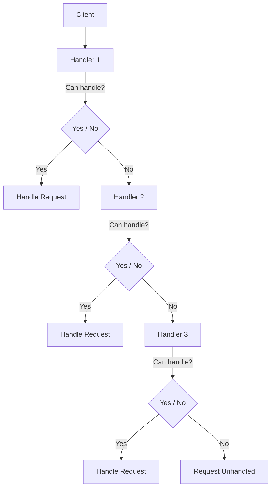
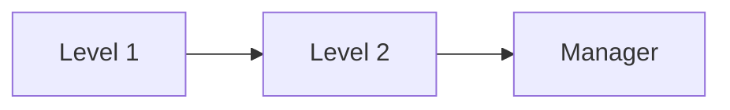
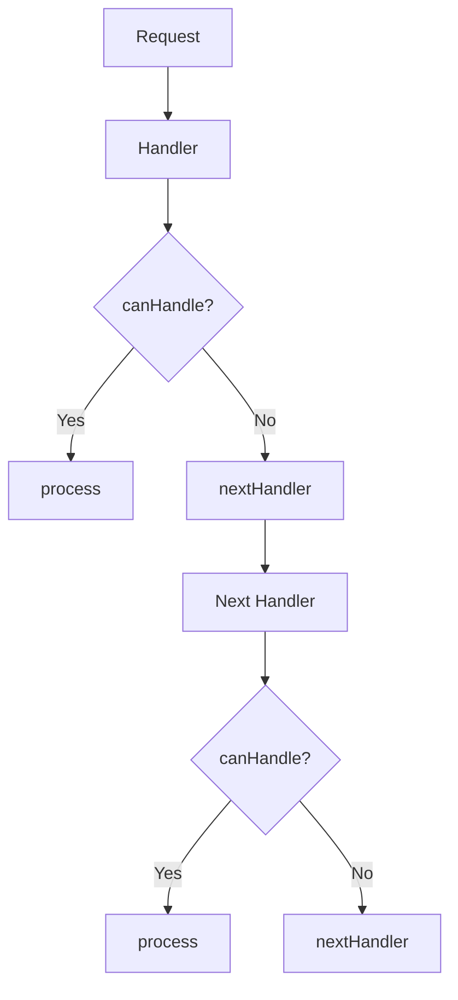
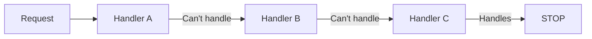
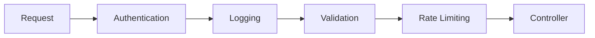

# Chain of Responsibility Pattern — TypeScript

## 1. What is Chain of Responsibility?

The **Chain of Responsibility (CoR)** pattern passes a request through a sequence of handlers.

Each handler decides:

1. **Can I handle this request?**
2. If yes → handle it.
3. If no → pass it to the next handler.



The important idea is:

> The client sends the request to the **chain**, not directly to the object that will handle it.

---

# 2. Basic Structure

A typical Chain of Responsibility implementation has these components:

```text
Client
  │
  ▼
Handler Interface
  │
  ├── ConcreteHandler A
  ├── ConcreteHandler B
  └── ConcreteHandler C
```

### Required components

| Component                        | Required? | Purpose                             |
| -------------------------------- | --------- | ----------------------------------- |
| Handler interface/abstract class | ✅         | Defines the common handler contract |
| `handle()` method                | ✅         | Processes or forwards the request   |
| Concrete handlers                | ✅         | Contain actual handling logic       |
| Next-handler reference           | Usually ✅ | Connects handlers together          |
| Client                           | ✅         | Starts the request                  |

### Optional components

| Component                      | Optional? | Purpose                              |
| ------------------------------ | --------- | ------------------------------------ |
| `setNext()`                    | Usually   | Allows dynamic chain construction    |
| Abstract base handler          | Optional  | Avoids repeating chain logic         |
| `canHandle()`                  | Optional  | Separates decision from handling     |
| Default/fallback handler       | Optional  | Handles requests nobody else handles |
| Result/response                | Optional  | Returns information to the client    |
| `next` as constructor argument | Optional  | Builds immutable-ish chains          |

---

# 3. Core Handler Interface

The simplest TypeScript structure:

```ts
interface Handler {
    setNext(handler: Handler): Handler;
    handle(request: Request): void;
}
```

There are two important methods here:

### `setNext()`

Connects one handler to another.

```ts
handlerA.setNext(handlerB);
```

### `handle()`

Attempts to process the request.

```ts
handlerA.handle(request);
```

---

# 4. Request

The request contains the information that handlers need to make their decision.

For example:

```ts
interface Request {
    amount: number;
}
```

You could have something more complex:

```ts
interface Request {
    amount: number;
    type: string;
    priority: number;
}
```

The request itself is **not technically a required CoR class**.

It can simply be:

```ts
handle(request: string)
```

or:

```ts
handle(request: SomeType)
```

The important thing is that handlers receive the same type of request.

---

# 5. Concrete Handler

A concrete handler contains the actual business logic.

```ts
class Level1Handler implements Handler {

    private nextHandler?: Handler;

    setNext(handler: Handler): Handler {
        this.nextHandler = handler;
        return handler;
    }

    handle(request: Request): void {

        if (request.amount <= 1000) {
            console.log("Level 1 handled the request");
            return;
        }

        this.nextHandler?.handle(request);
    }
}
```

Notice the important flow:

```text
Can I handle it?
      │
   ┌──┴──┐
  YES    NO
   │      │
   ▼      ▼
Handle   nextHandler
```

---

# 6. Multiple Handlers

Let's create three handlers.

```ts
class Level1Handler implements Handler {

    private nextHandler?: Handler;

    setNext(handler: Handler): Handler {
        this.nextHandler = handler;
        return handler;
    }

    handle(request: Request): void {

        if (request.amount <= 1000) {
            console.log("Level 1 handled");
            return;
        }

        this.nextHandler?.handle(request);
    }
}
```

```ts
class Level2Handler implements Handler {

    private nextHandler?: Handler;

    setNext(handler: Handler): Handler {
        this.nextHandler = handler;
        return handler;
    }

    handle(request: Request): void {

        if (request.amount <= 10000) {
            console.log("Level 2 handled");
            return;
        }

        this.nextHandler?.handle(request);
    }
}
```

```ts
class ManagerHandler implements Handler {

    private nextHandler?: Handler;

    setNext(handler: Handler): Handler {
        this.nextHandler = handler;
        return handler;
    }

    handle(request: Request): void {

        console.log("Manager handled");
    }
}
```

---

# 7. Building the Chain

Now the client creates the chain.

```ts
const level1 = new Level1Handler();
const level2 = new Level2Handler();
const manager = new ManagerHandler();

level1
    .setNext(level2)
    .setNext(manager);
```

This creates:



Then:

```ts
level1.handle({ amount: 500 });
```

Flow:

```text
Client
  │
  ▼
Level 1
  │
  └── handles it
```

For:

```ts
level1.handle({ amount: 5000 });
```

Flow becomes:

```text
Client
  │
  ▼
Level 1
  │
  │ cannot handle
  ▼
Level 2
  │
  └── handles it
```

For:

```ts
level1.handle({ amount: 50000 });
```

```text
Client
  │
  ▼
Level 1
  │
  ▼
Level 2
  │
  ▼
Manager
  │
  └── handles it
```

---

# 8. Complete Minimal Implementation

This is probably the most useful structure to remember.

```ts
interface Request {
    amount: number;
}

interface Handler {
    setNext(handler: Handler): Handler;
    handle(request: Request): void;
}

class HandlerA implements Handler {

    private nextHandler?: Handler;

    setNext(handler: Handler): Handler {
        this.nextHandler = handler;
        return handler;
    }

    handle(request: Request): void {

        if (/* can handle */) {
            // handle request
            return;
        }

        this.nextHandler?.handle(request);
    }
}

class HandlerB implements Handler {

    private nextHandler?: Handler;

    setNext(handler: Handler): Handler {
        this.nextHandler = handler;
        return handler;
    }

    handle(request: Request): void {

        if (/* can handle */) {
            // handle request
            return;
        }

        this.nextHandler?.handle(request);
    }
}

class HandlerC implements Handler {

    private nextHandler?: Handler;

    setNext(handler: Handler): Handler {
        this.nextHandler = handler;
        return handler;
    }

    handle(request: Request): void {

        if (/* can handle */) {
            // handle request
            return;
        }

        // No next handler
    }
}
```

Client:

```ts
const handlerA = new HandlerA();
const handlerB = new HandlerB();
const handlerC = new HandlerC();

handlerA
    .setNext(handlerB)
    .setNext(handlerC);

handlerA.handle(request);
```

---

# 9. The Abstract Base Handler

When you have many handlers, you'll notice that this code is repeated:

```ts
private nextHandler?: Handler;

setNext(handler: Handler): Handler {
    this.nextHandler = handler;
    return handler;
}
```

That's where an **abstract base handler** can help.

```ts
abstract class BaseHandler implements Handler {

    protected nextHandler?: Handler;

    setNext(handler: Handler): Handler {
        this.nextHandler = handler;
        return handler;
    }

    abstract handle(request: Request): void;
}
```

Now concrete handlers only need to worry about their business logic:

```ts
class Level1Handler extends BaseHandler {

    handle(request: Request): void {

        if (request.amount <= 1000) {
            console.log("Level 1 handled");
            return;
        }

        this.nextHandler?.handle(request);
    }
}
```

```ts
class Level2Handler extends BaseHandler {

    handle(request: Request): void {

        if (request.amount <= 10000) {
            console.log("Level 2 handled");
            return;
        }

        this.nextHandler?.handle(request);
    }
}
```

This is often a **cleaner production structure**.

---

# 10. Better Structure: `canHandle()` + `handle()`

Another useful design is to separate:

> **"Can I handle this?"**

from:

> **"How do I handle it?"**

For example:

```ts
abstract class BaseHandler {

    protected nextHandler?: BaseHandler;

    setNext(handler: BaseHandler): BaseHandler {
        this.nextHandler = handler;
        return handler;
    }

    handle(request: Request): void {

        if (this.canHandle(request)) {
            this.process(request);
            return;
        }

        this.nextHandler?.handle(request);
    }

    protected abstract canHandle(request: Request): boolean;

    protected abstract process(request: Request): void;
}
```

Then:

```ts
class Level1Handler extends BaseHandler {

    protected canHandle(request: Request): boolean {
        return request.amount <= 1000;
    }

    protected process(request: Request): void {
        console.log("Level 1 processed request");
    }
}
```

This gives you:



This structure is especially useful when all handlers follow the same pattern.

---

# 11. Important: Who Builds the Chain?

Usually **the client/composition root** builds the chain.

```ts
const auth = new AuthHandler();
const validation = new ValidationHandler();
const rateLimit = new RateLimitHandler();
const controller = new ControllerHandler();

auth
    .setNext(validation)
    .setNext(rateLimit)
    .setNext(controller);
```

Then:

```ts
auth.handle(request);
```

The client doesn't need to know which handler eventually handles it.


---

# 12. Important Rule: The Chain Does NOT Have to Stop

This is an important variation.

### Stop after handling

```ts
if (this.canHandle(request)) {
    this.process(request);
    return;
}

this.nextHandler?.handle(request);
```

Flow:

```text
A → B → C
    ↑
    B handles
    STOP
```

This is common when **only one handler should handle the request**.

---

### Continue after handling

You could instead do:

```ts
if (this.canHandle(request)) {
    this.process(request);
}

this.nextHandler?.handle(request);
```

Now:

```text
A → B → C
    ↓   ↓
  handles
      ↓
    continues
```

This is useful when **multiple handlers can process the same request**.

For example:

```text
Request
   ↓
Authentication
   ↓
Logging
   ↓
Validation
   ↓
Caching
   ↓
Controller
```

Here, you often want **all** relevant handlers to execute.

---

# 13. Two Common Forms of CoR

### Form 1 — One handler handles



Use when:

> "Find the first object capable of handling this."

Examples:

* Support escalation
* Approval levels
* Exception handling
* Discount rules
* Authorization levels

---

### Form 2 — Multiple handlers process



Use when:

> "Give every handler a chance to process the request."

Examples:

* HTTP middleware
* Request pipelines
* Logging
* Authentication
* Validation
* Authorization

This is why frameworks such as Express-style middleware feel very similar to Chain of Responsibility.

---

# 14. What Is Actually Necessary?

If you're learning the pattern for interviews/design patterns, remember this **minimum structure**:

```text
                ┌───────────────────┐
                │      Handler      │
                ├───────────────────┤
                │ + setNext()       │
                │ + handle()        │
                └─────────┬─────────┘
                          │
             ┌────────────┼────────────┐
             ▼            ▼            ▼
        Handler A     Handler B     Handler C
```

### Absolutely important

```ts
handle()
```

and the concept of:

```ts
nextHandler
```

### Usually present

```ts
setNext()
```

### Optional

```ts
canHandle()
process()
BaseHandler
Request class
Response class
Fallback handler
```

You don't need every one of these to legitimately implement Chain of Responsibility.

---

# 15. The Most Important Concept

Don't memorize:

> "Chain of Responsibility means `setNext()` + `handle()`."

Instead remember:

> **A request is decoupled from the object that ultimately handles it.**

The request starts somewhere in the chain:

```text
Client
  ↓
Handler A
  ↓
Handler B
  ↓
Handler C
```

The client only needs to know:

```ts
handler.handle(request);
```

It doesn't need:

```ts
if (type === "A") handlerA.handle();
else if (type === "B") handlerB.handle();
else if (type === "C") handlerC.handle();
```

That's the real benefit of the pattern.
