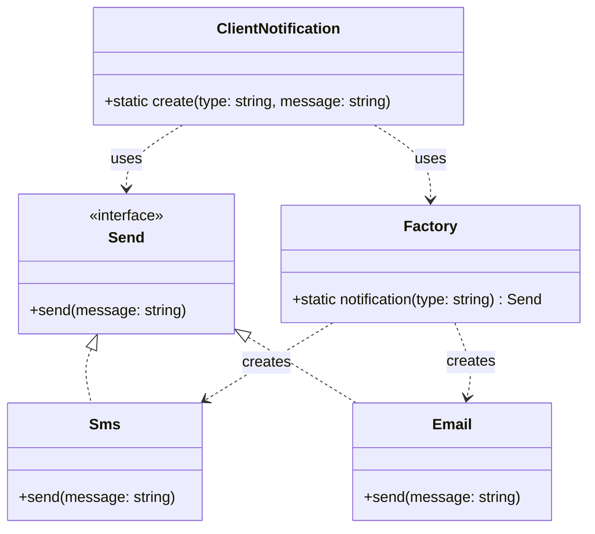
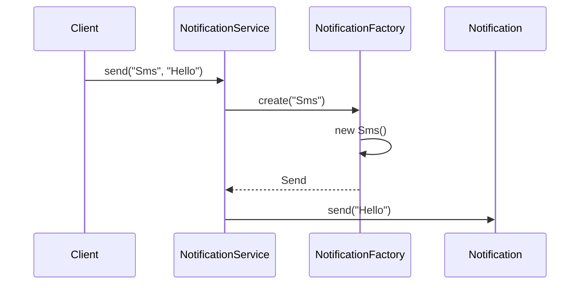
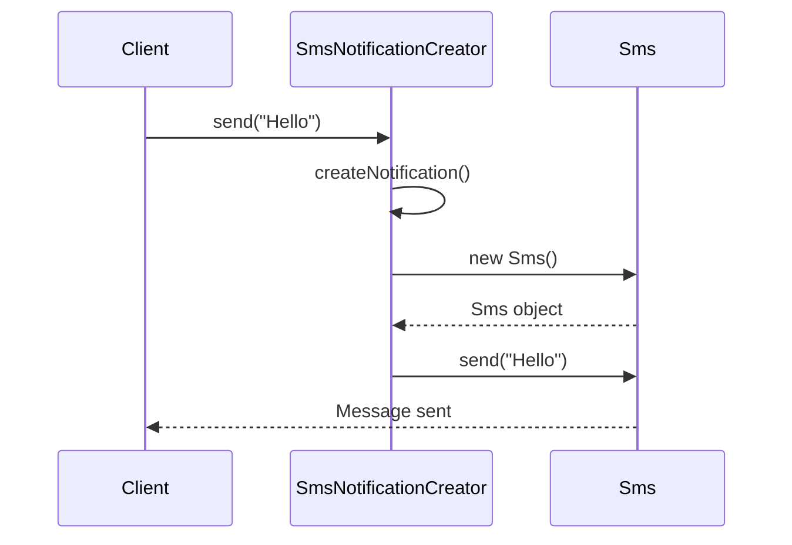

# 🏭 Factory Pattern — LLD

The Factory Pattern is used when **object creation should be separated from the code that uses the object**.

Instead of letting the client directly create concrete objects:

```ts
const sms = new Sms();
const email = new Email();
```

we move object creation behind a Factory or Factory Method.

---

# 📚 Factory-Related Patterns

There are three commonly discussed factory-related approaches:

1. **Simple Factory**
2. **Factory Method** — GoF Design Pattern
3. **Abstract Factory** — GoF Design Pattern

This README focuses on:

* Simple Factory
* Factory Method
* SOLID principles
* Why Factory Method improves extensibility

---

# 1. The Problem

Suppose our application supports multiple notification types:

```text
SMS
Email
WhatsApp
Push Notification
```

All notifications should support:

```ts
send(message: string)
```

We can create a common abstraction:

```ts
interface Send {
    send(message: string): void;
}
```

Then concrete implementations:

```text
             Send
            /    \
          Sms    Email
```

---

# 2. Without Factory

The client can directly create objects:

```ts
class Sms implements Send {

    send(message: string): void {
        console.log(`${message} message through SMS`);
    }
}

class Email implements Send {

    send(message: string): void {
        console.log(`${message} message through Email`);
    }
}
```

Client:

```ts
const type = "Sms";

if (type === "Sms") {

    const notification = new Sms();
    notification.send("Hello");

} else if (type === "Email") {

    const notification = new Email();
    notification.send("Hello");
}
```

### Problem

The client now knows:

```text
Sms
Email
new Sms()
new Email()
```

The client is tightly coupled to concrete implementations.

If object creation becomes complicated, the client also becomes responsible for that complexity.

---

# 3. Simple Factory

## Core Idea

> Put object creation logic in one central place.

The client doesn't directly create `Sms` or `Email`.

Instead:

```ts
Factory.notification("Sms");
```

The Factory decides which object to create.

---

## Structure



---

# 4. Simple Factory — TypeScript

```ts
interface Send {
    send(message: string): void;
}

class Sms implements Send {

    send(message: string): void {
        console.log(`${message} message through SMS`);
    }
}

class Email implements Send {

    send(message: string): void {
        console.log(`${message} message through Email`);
    }
}

class NotificationFactory {

    static create(type: string): Send {

        switch (type) {

            case "Sms":
                return new Sms();

            case "Email":
                return new Email();

            default:
                throw new Error("Unknown notification type");
        }
    }
}
```

---

# 5. Using the Simple Factory

A service/client can use the Factory:

```ts
class NotificationService {

    static send(type: string, message: string): void {

        const notification = NotificationFactory.create(type);

        notification.send(message);
    }
}
```

Usage:

```ts
NotificationService.send("Sms", "Hello");

NotificationService.send("Email", "Hello");
```

Output:

```text
Hello message through SMS
Hello message through Email
```

---

# 6. Simple Factory Flow



The important part:

```text
Client
   ↓
Service
   ↓
Factory
   ↓
Concrete Product
```

---

# 7. What Did Simple Factory Solve?

Before:

```text
Client
 ├── new Sms()
 ├── new Email()
 └── knows concrete classes
```

After:

```text
Client
   ↓
Factory
   ↓
Sms / Email
```

The client no longer needs to know how the object is created.

### Main benefit

> **Object creation is centralized and hidden from the client.**

---

# 8. The Problem With Simple Factory

Suppose we add WhatsApp:

```ts
class WhatsApp implements Send {

    send(message: string): void {
        console.log(`${message} message through WhatsApp`);
    }
}
```

We must modify the Factory:

```ts
class NotificationFactory {

    static create(type: string): Send {

        switch (type) {

            case "Sms":
                return new Sms();

            case "Email":
                return new Email();

            case "WhatsApp":
                return new WhatsApp();

            default:
                throw new Error("Unknown notification type");
        }
    }
}
```

Every new notification requires modifying the Factory.

---

# 9. Open/Closed Principle Problem

The **Open/Closed Principle (OCP)** says:

> Software entities should be open for extension but closed for modification.

Our Simple Factory requires modification:

```text
Add WhatsApp
     ↓
Modify Factory
```

Then:

```text
Add Push
     ↓
Modify Factory
```

Then:

```text
Add Telegram
     ↓
Modify Factory
```

The Factory can eventually become:

```ts
switch (type) {

    case "Sms":
        ...

    case "Email":
        ...

    case "WhatsApp":
        ...

    case "Push":
        ...

    case "Telegram":
        ...

    case "Slack":
        ...

    // ...
}
```

This becomes difficult to maintain.

---

# 10. Factory Method

Factory Method solves this problem differently.

Instead of having:

```text
One Factory
     |
     ├── Sms
     ├── Email
     ├── WhatsApp
     └── Push
```

we introduce a **Creator**.

```text
              NotificationCreator
                      |
             createNotification()
                      |
          ┌───────────┴───────────┐
          ↓                       ↓
    SmsNotificationCreator   EmailNotificationCreator
          |                       |
          ↓                       ↓
       new Sms()              new Email()
```

The key idea is:

> **The base Creator defines the common workflow, while subclasses decide which object to create.**

---

# 11. Factory Method — Components

There are four important components.

### 1. Product

```ts
interface Send {
    send(message: string): void;
}
```

### 2. Concrete Products

```ts
Sms
Email
WhatsApp
```

### 3. Creator

```ts
abstract class NotificationCreator {

    abstract createNotification(): Send;

    send(message: string) {
        const notification = this.createNotification();

        notification.send(message);
    }
}
```

### 4. Concrete Creators

```ts
SmsNotificationCreator
EmailNotificationCreator
WhatsAppNotificationCreator
```

---

# 12. Factory Method — Complete Code

## Product

```ts
interface Send {
    send(message: string): void;
}
```

---

## Concrete Products

```ts
class Sms implements Send {

    send(message: string): void {
        console.log(`${message} message through SMS`);
    }
}

class Email implements Send {

    send(message: string): void {
        console.log(`${message} message through Email`);
    }
}
```

---

## Creator

```ts
abstract class NotificationCreator {

    // Factory Method
    abstract createNotification(): Send;

    // Common workflow
    send(message: string): void {

        const notification = this.createNotification();

        notification.send(message);
    }
}
```

---

## Concrete Creators

```ts
class SmsNotificationCreator
    extends NotificationCreator {

    createNotification(): Send {
        return new Sms();
    }
}
```

```ts
class EmailNotificationCreator
    extends NotificationCreator {

    createNotification(): Send {
        return new Email();
    }
}
```

---

## Client

```ts
const smsCreator = new SmsNotificationCreator();

smsCreator.send("Hello");
```

And:

```ts
const emailCreator = new EmailNotificationCreator();

emailCreator.send("Hello");
```

---

# 13. Where Is the Factory Method?

This method:

```ts
abstract createNotification(): Send;
```

is the **Factory Method**.

The parent class declares it:

```ts
abstract createNotification(): Send;
```

but doesn't decide which object to create.

The subclasses decide.

### SMS

```ts
class SmsNotificationCreator
    extends NotificationCreator {

    createNotification(): Send {
        return new Sms();
    }
}
```

### Email

```ts
class EmailNotificationCreator
    extends NotificationCreator {

    createNotification(): Send {
        return new Email();
    }
}
```

---

# 14. Why Does the Parent Call an Abstract Method?

This is one of the most important concepts.

We have:

```ts
abstract class NotificationCreator {

    abstract createNotification(): Send;

    send(message: string) {

        const notification = this.createNotification();

        notification.send(message);
    }
}
```

The parent doesn't implement:

```ts
createNotification()
```

but it calls it.

Why?

Because of **polymorphism**.

Suppose:

```ts
const creator = new SmsNotificationCreator();

creator.send("Hello");
```

`send()` comes from the parent:

```text
SmsNotificationCreator
        ↑
NotificationCreator.send()
```

Inside:

```ts
this.createNotification();
```

`this` refers to the actual object:

```text
SmsNotificationCreator
```

Therefore:

```ts
SmsNotificationCreator.createNotification()
```

is called.

Which returns:

```ts
new Sms();
```

---

# 15. Factory Method Flow



---

# 16. Adding WhatsApp

Now suppose we need WhatsApp.

First create the product:

```ts
class WhatsApp implements Send {

    send(message: string): void {
        console.log(`${message} message through WhatsApp`);
    }
}
```

Then create its Creator:

```ts
class WhatsAppNotificationCreator
    extends NotificationCreator {

    createNotification(): Send {
        return new WhatsApp();
    }
}
```

That's it.

No modification to:

```text
NotificationCreator
Sms
Email
SmsNotificationCreator
EmailNotificationCreator
```

We simply extended the system.

---

# 17. Why Factory Method Is Better for OCP

Simple Factory:

```text
Add new product
       ↓
Modify Factory
       ↓
Add another if/switch case
```

Factory Method:

```text
Add new product
       ↓
Create new Product
       +
Create new Concrete Creator
```

Therefore:

```text
Existing code → CLOSED for modification
New behavior  → OPEN for extension
```

This is the main reason Factory Method is useful when the number of product types is expected to grow.

---

# 18. SOLID Principles

## S — Single Responsibility Principle

Each class has a focused responsibility.

### Sms

Responsible for SMS behavior:

```ts
class Sms implements Send {

    send(message: string) {
        // SMS logic
    }
}
```

### SmsNotificationCreator

Responsible for creating SMS:

```ts
class SmsNotificationCreator
    extends NotificationCreator {

    createNotification() {
        return new Sms();
    }
}
```

### NotificationCreator

Responsible for the common workflow:

```ts
send(message: string) {
    const notification = this.createNotification();

    notification.send(message);
}
```

---

# 19. O — Open/Closed Principle

The biggest advantage of Factory Method.

Adding WhatsApp:

```ts
class WhatsApp implements Send {
    send(message: string) {
        console.log(message);
    }
}
```

and:

```ts
class WhatsAppNotificationCreator
    extends NotificationCreator {

    createNotification(): Send {
        return new WhatsApp();
    }
}
```

We don't modify the existing classes.

Therefore the design is much more extensible.

---

# 20. L — Liskov Substitution Principle

Every concrete notification implements:

```ts
interface Send {
    send(message: string): void;
}
```

Therefore:

```ts
const notification: Send = new Sms();
```

and:

```ts
const notification: Send = new Email();
```

can both be used wherever `Send` is expected.

Similarly:

```text
NotificationCreator
       ↑
 ┌─────┼───────────────┐
 ↓     ↓               ↓
Sms   Email         WhatsApp
Creator Creator       Creator
```

Concrete creators can substitute the base Creator.

---

# 21. I — Interface Segregation Principle

Our interface is small:

```ts
interface Send {
    send(message: string): void;
}
```

We aren't forcing every notification to implement unrelated methods.

For example, we don't have:

```ts
interface Send {

    send();
    receive();
    download();
    upload();
    delete();
    encrypt();
}
```

A small, focused interface is easier to implement and maintain.

---

# 22. D — Dependency Inversion Principle

The Creator works with:

```ts
Send
```

instead of depending directly on:

```ts
Sms
Email
WhatsApp
```

For example:

```ts
abstract createNotification(): Send;
```

The high-level workflow depends on the abstraction.

```text
                 Send
                  ↑
          ┌───────┼───────┐
          ↓       ↓       ↓
         Sms    Email  WhatsApp
```

---

# 23. Simple Factory vs Factory Method

| Feature           | Simple Factory   | Factory Method     |
| ----------------- | ---------------- | ------------------ |
| Object creation   | Central Factory  | Concrete Creator   |
| Decision          | Factory          | Subclass           |
| `switch/if`       | Usually required | Usually avoided    |
| New product       | Modify Factory   | Add new Creator    |
| OCP               | Weaker           | Better             |
| Number of classes | Fewer            | More               |
| Complexity        | Low              | Higher             |
| Flexibility       | Lower            | Higher             |
| Best for          | Small systems    | Extensible systems |

---

# 24. The Most Important Difference

### Simple Factory

```ts
Factory.create("Sms");
```

The Factory decides:

```text
             Factory
                |
       "What should I create?"
                |
          ┌─────┴─────┐
          ↓           ↓
         Sms        Email
```

---

### Factory Method

```ts
smsCreator.send("Hello");
```

The Concrete Creator decides:

```text
       NotificationCreator
                |
       createNotification()
                ↑
                |
       SmsNotificationCreator
                |
                ↓
             new Sms()
```

---

# 25. `new` Keyword and Factory

`new` means:

> **Create an instance/object of a class.**

For example:

```ts
const sms = new Sms();
```

The Factory can use `new`:

```ts
return new Sms();
```

because its job is to create the object.

But a static method doesn't require creating an instance of its own class.

### Static method

```ts
class Factory {

    static create() {
        return new Sms();
    }
}
```

Call:

```ts
Factory.create();
```

Not:

```ts
new Factory().create();
```

because `create()` belongs to the class itself.

---

# 26. Static vs Instance Method

### Static

```ts
class Factory {

    static create() {
        return new Sms();
    }
}

Factory.create();
```

The method belongs to:

```text
Factory
   |
   └── create()
```

---

### Instance

```ts
class Factory {

    create() {
        return new Sms();
    }
}

const factory = new Factory();

factory.create();
```

The method belongs to the object:

```text
Factory
   ↓
object
   |
   └── create()
```

---

# 27. When Should You Use Simple Factory?

Simple Factory is useful when:

* There are only a few product types.
* Product types don't change frequently.
* You want to hide object creation from the client.
* A small `switch` is acceptable.
* You don't need the extra classes introduced by Factory Method.

Example:

```ts
const notification =
    NotificationFactory.create("Sms");
```

For a small application, this can be perfectly reasonable.

---

# 28. When Should You Use Factory Method?

Factory Method is useful when:

* New product types will frequently be added.
* You want to follow OCP more strictly.
* Different subclasses need different creation logic.
* Object creation varies but the overall workflow remains the same.
* You want to avoid a large central `switch`.

Example:

```text
NotificationCreator
        |
        ├── SmsCreator
        ├── EmailCreator
        ├── WhatsAppCreator
        └── PushCreator
```

---

# 29. The Evolution of the Design

The easiest way to understand Factory Method is to see how the design evolves.

### Step 1 — Direct creation

```text
Client
  |
  ├── new Sms()
  └── new Email()
```

Problem:

```text
Client knows concrete classes
```

---

### Step 2 — Simple Factory

```text
Client
   ↓
Factory
   ↓
Sms / Email
```

Problem:

```text
Factory grows with every new product
```

---

### Step 3 — Factory Method

```text
Client
   ↓
Concrete Creator
   ↓
Factory Method
   ↓
Concrete Product
```

Now new products can be added by creating new classes instead of modifying the existing Factory.

---

# 30. Final Mental Model

Remember these two sentences.

## Simple Factory

> **"Tell me what you want, and I will create it."**

```ts
NotificationFactory.create("Sms");
```

The **Factory decides**.

---

## Factory Method

> **"I know the workflow, but my subclass decides what object I should create."**

```ts
creator.send("Hello");
```

The **Concrete Creator decides**.

The key method is:

```ts
abstract createNotification(): Send;
```

The parent defines the method.

The child implements it.

---

# 🧠 Quick Revision

```text
FACTORY PATTERN
│
├── Simple Factory
│   │
│   ├── Centralized object creation
│   ├── Usually uses switch/if
│   ├── Easy to implement
│   └── Can violate OCP as it grows
│
└── Factory Method
    │
    ├── Creator defines factory method
    ├── Concrete Creator creates product
    ├── Uses inheritance + polymorphism
    ├── Better OCP
    └── More classes / more complexity
```

### One-line definition

> **Factory Method defines a method for creating an object, but lets subclasses decide which concrete object to create.**

---

# ⭐ Interview Answer

If asked:

**"Why do we use Factory Method?"**

A good answer is:

> "Factory Method is used to separate object creation from the code that uses the object. The base Creator defines the common workflow and declares a factory method, while concrete subclasses override that method to create the appropriate product. This reduces coupling and makes the system easier to extend, especially following the Open/Closed Principle."

---

# 🔥 Most Important Code to Remember

```ts
abstract class Creator {

    // Factory Method
    abstract createProduct(): Product;

    // Common workflow
    operation() {

        const product = this.createProduct();

        product.doSomething();
    }
}
```

Then:

```ts
class ConcreteCreator extends Creator {

    createProduct(): Product {
        return new ConcreteProduct();
    }
}
```

That structure is the **heart of Factory Method**.
